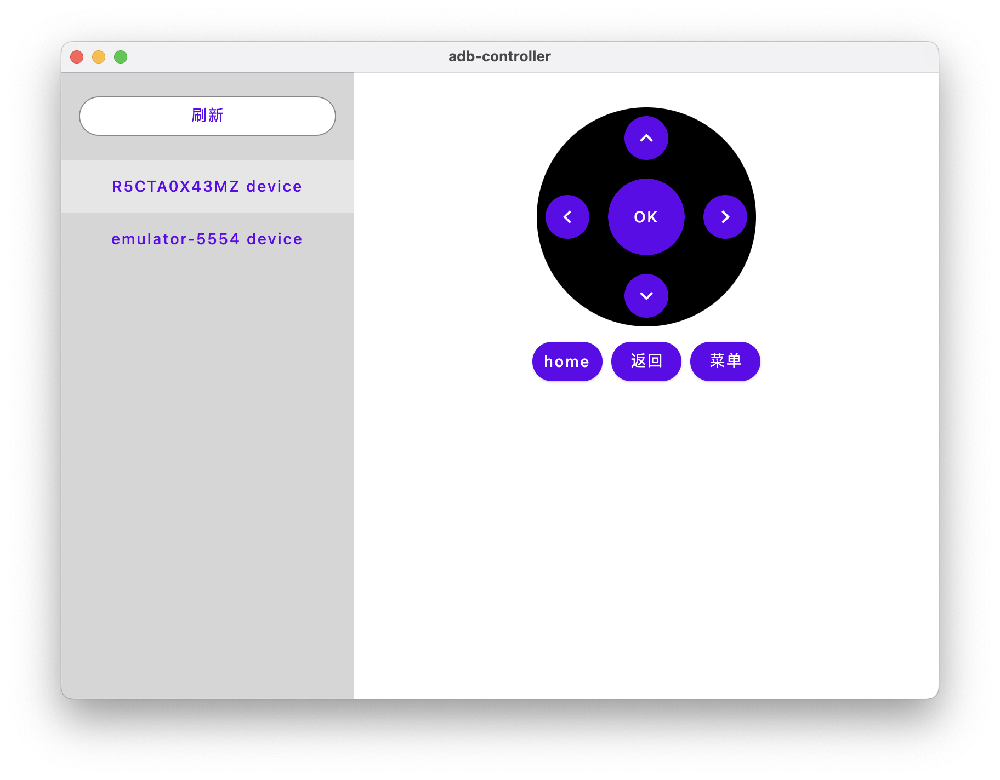

<!--
 * @Author: wangyincan wangyincan@corp.netease.com
 * @Date: 2024-04-02 16:23:44
 * @LastEditors: wangyincan wangyincan@corp.netease.com
 * @LastEditTime: 2024-07-03 17:19:40
 * @FilePath: /adb-controller/README.md
 * @Description: 这是默认设置,请设置`customMade`, 打开koroFileHeader查看配置 进行设置: https://github.com/OBKoro1/koro1FileHeader/wiki/%E9%85%8D%E7%BD%AE
-->

参考：

Learn more about [Kotlin Multiplatform](https://www.jetbrains.com/help/kotlin-multiplatform-dev/get-started.html)…

[compose](https://developer.android.com/develop/ui/compose/lifecycle?hl=zh-cn)

https://juejin.cn/post/7307934456995774499?searchId=202405301754360D4FBE752B528DFF462E

https://juejin.cn/post/7324384083428835367?searchId=202405301845401FB7E2FE1D0B890A379F#heading-34

https://jetpackcompose.cn/docs/

预览图：

  
